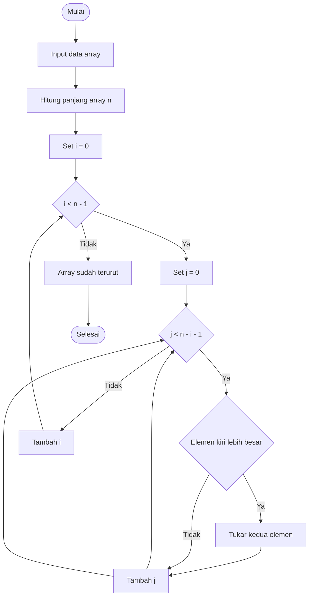

# Bubble Sort Algorithm (PHP)

Bubble Sort adalah algoritma pengurutan sederhana yang bekerja dengan cara membandingkan dua elemen yang bersebelahan dan menukarnya jika urutannya salah. Proses ini diulang sampai seluruh data terurut.

---

## 📊 Flowchart Bubble Sort

---

## 📝 Penjelasan Singkat Flowchart

1. Program dimulai dengan menerima data array
2. Panjang array dihitung dan disimpan dalam variabel `n`
3. Perulangan luar (`i`) menentukan jumlah iterasi
4. Perulangan dalam (`j`) membandingkan elemen yang bersebelahan
5. Jika elemen kiri lebih besar, maka dilakukan penukaran
6. Elemen terbesar akan berpindah ke posisi akhir setiap iterasi
7. Setelah semua proses selesai, array menjadi terurut
8. Program berakhir

---
